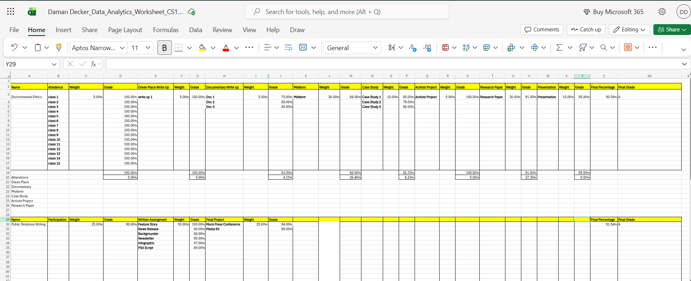

# CS105 Portfolio
# Daman Decker
## Portfolio
Contact Info: [240-320-6185 
dddecker@loyola.edu]
### About Me 
My is Daman and I am a Junior at Loyola University Maryland. I am a full time student as well as United States Army reservist. My major is communications, with a focus in advertising and public relations. I am also pursuing a minor in military science. I am set to graduate in 2027 and commission as a second lieutenant in the army. 

### Experience and Skills
While pursuing my bachelor's in communications I have developed a varied skill set that allows me to function as an adept marketer, advertiser, and journalist. I am well versed in Adobe, and specialize in audio and video production. In my time in the army, I have developed a strong skill set that allows me to easily step into leadership positions large and small. I have had the opportunity to coordinate large scale training events, as well as long term administrative duties. I have been responsible for up to 50 people at a time as well as hundreds of thousands of government equipment. In the military I have also had the chance to train at the United States Military Academy, as well as Fort Knox, Kentucky.     

***
### Projects

# Data Analytics Worksheet

This project functions as an executive database for all costs associated with your small business. The excel spreadsheet is easy to edit to your needs and has all necessary data and tables formatted in a manner that's easy to use.   

 

   [Finance Project](https://1drv.ms/x/c/aea17305ae6f9b29/IQDFTchZk_SdR41VZMs9LsfxAYJjnF2hmQn7DXyIMI0msIo?e=IDcCjH)
***
# Fruit Based Personality Test

This is my rendition of a personality test. I used fruits as stand-ins for the basic four personality types, with introverted being **pear**, extroverted being **apple**, analytical being **orange**, and creative being **guava**. The intention behind this was to demonstrate python repetition structures with a fun twist. 

[Fruit Based Personality Test](https://github.com/LoyolaUnivMD/sp26-cs105-python-final-project-Daman-Decker.git)
***
# Grade Calculator
 
This project is an excel spreadsheet that can be used to easily calculate grades through simple inputs. With it being easy to edit, anyone can use it for their own grade calculation needs.  
 

[Grade Calculator](https://1drv.ms/x/c/aea17305ae6f9b29/IQDFTchZk_SdR41VZMs9LsfxAYJjnF2hmQn7DXyIMI0msIo?e=IDcCjH)

